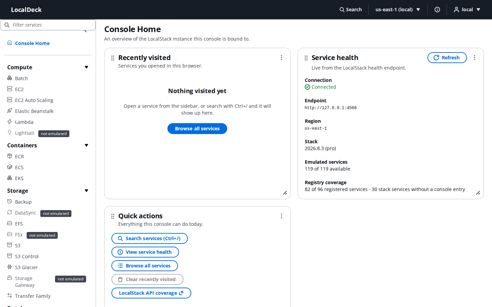
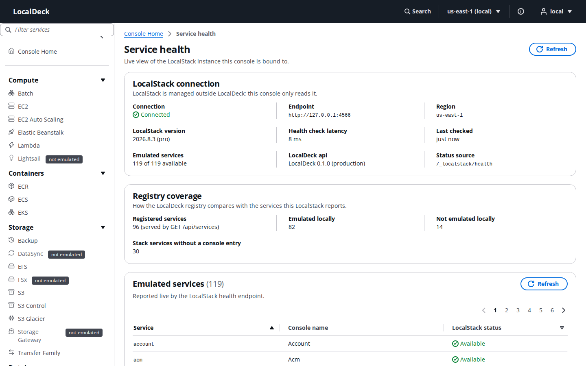
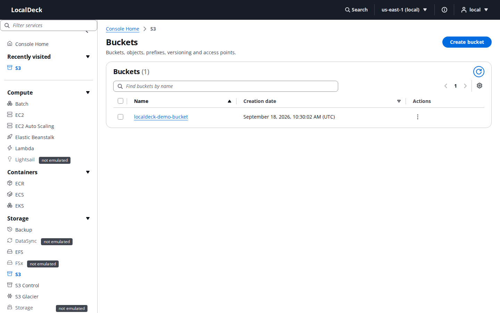
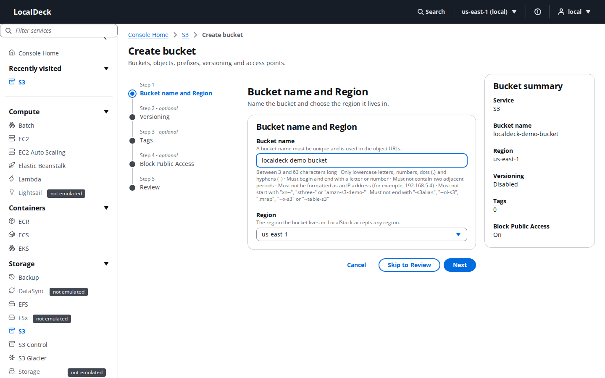
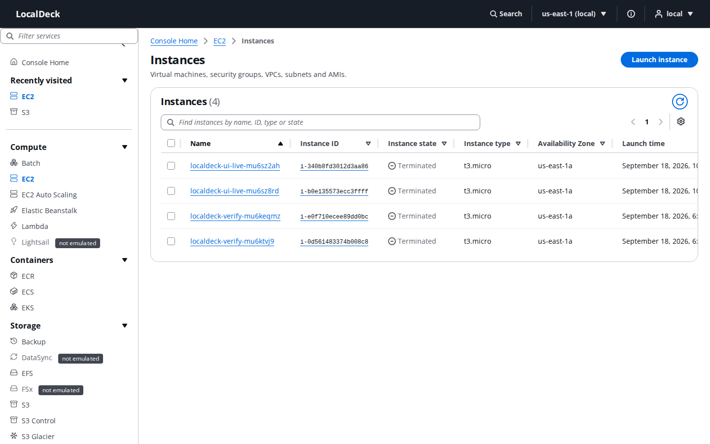
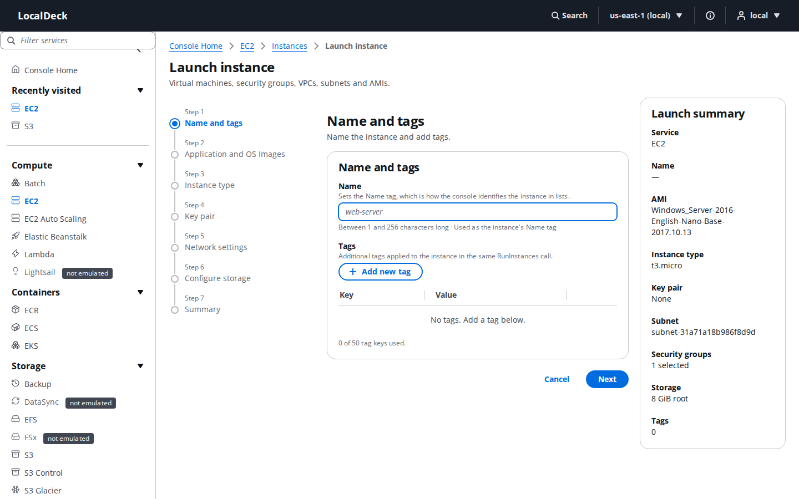
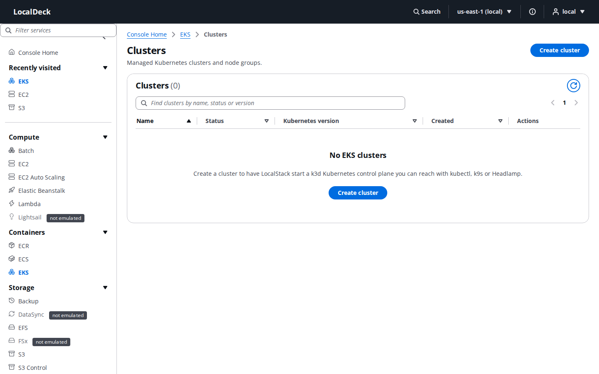
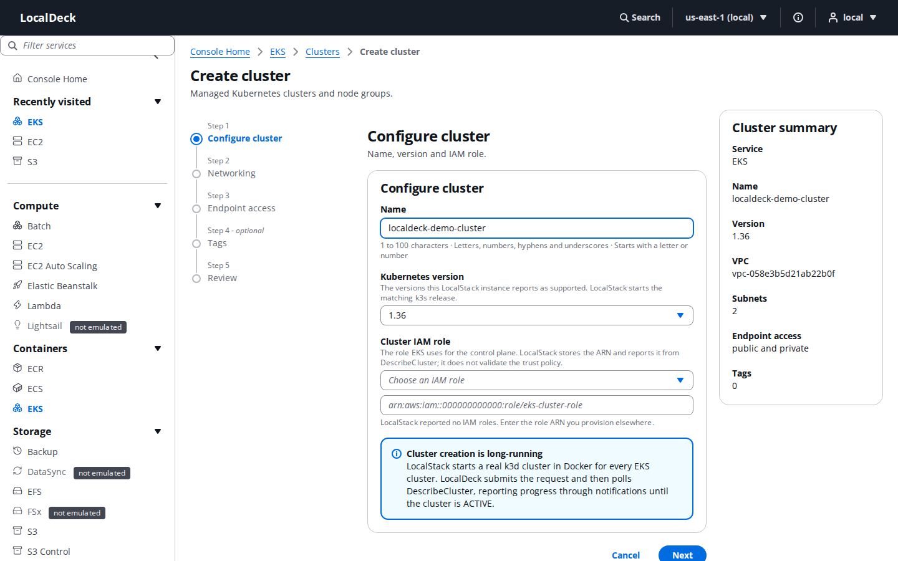

# LocalDeck

[](https://github.com/kubaeror/localdeck/actions/workflows/ci.yml)
[](LICENSE)
[](https://nodejs.org/)

An open-source web console for [LocalStack](https://docs.localstack.cloud/), the
local cloud emulator. LocalDeck looks and behaves like the cloud console people
already know (Cloudscape Design System), but it is an independent project:
**LocalStack is managed by you, outside this repository.** LocalDeck never
starts, stops, reconfigures or wipes it — when the emulator is unreachable, the
console reports that clearly instead of trying to fix it.

## What it looks like

Every screenshot below was captured from LocalDeck's own ui
(`e2e/scripts/capture-screenshots.ts`). The repository never contains
screenshots of another cloud console.

|                   Console Home                   |                      Service health                      |
| :----------------------------------------------: | :------------------------------------------------------: |
|    |        |
|                    S3 buckets                    |                      Create bucket                       |
|        |       |
|                  EC2 instances                   |                     Launch instance                      |
|  |  |
|                   EKS clusters                   |                      Create cluster                      |
|    |    |

The images are captured by `e2e/scripts/capture-screenshots.ts` against
whatever stack is running, so a parity count rendered inside a screenshot (for
example "Registered services" on Service health) can lag the generated table
below until the next refresh; run `pnpm test:e2e:screens` after registry
changes. CI regenerates them against the container stack and uploads them as
the `docs-screens` artifact.

## Repository layout

```
apps/api           Fastify 5 proxy — the only process that talks to LocalStack
apps/ui            React 18 + Vite + Cloudscape single-page console
packages/shared    Shared DTO types and the ApiError contract
docker-compose.yml local api + ui only (never LocalStack)
```

## Prerequisites

- **A LocalStack instance you manage yourself**, already running
  (`http://localhost:4566` by default). LocalDeck never starts, stops or
  reconfigures it.
  - Current LocalStack releases (2026.03+) require an auth token to start; set
    `LOCALSTACK_AUTH_TOKEN` in _your_ LocalStack environment, never here.
  - **EKS** additionally needs a LocalStack entitlement that includes EKS
    (the Ultimate plan) **and** the Docker socket mounted into _your_ LocalStack
    container, because its k3d provider starts real Kubernetes containers:
    `-v /var/run/docker.sock:/var/run/docker.sock`.
- **Node.js 22** (CI version) or Node 20.19+ (see `.nvmrc`), and pnpm 10
  (`corepack enable pnpm`) — for the no-container quick start.
- **Docker with Compose 2.24+** — for the container quick start. The loopback
  override uses the `!reset` tag introduced in Compose 2.24.

## Quick start — your LocalStack, Docker Compose (under 5 minutes)

```bash
# 1. Start your own LocalStack and export the endpoint LocalDeck should use.
#    (This step is YOURS: LocalDeck never starts or manages LocalStack.)
export LOCALSTACK_ENDPOINT=http://host.docker.internal:4566

# 2. Start the LocalDeck api and ui.
docker compose up --build
```

Then open <http://localhost:8080>. The api is on <http://localhost:3001>.

- `LOCALSTACK_ENDPOINT` defaults to `http://host.docker.internal:4566` (the
  Docker host) and is only ever an env var — never hardcoded in an image.
- LocalStack published on the host loopback only (typical WSL2 + local Docker
  engine)? Use
  `docker compose -f docker-compose.yml -f docker-compose.loopback.yml up`
  (requires Compose 2.24+).
- Only `api` and `ui` are defined in `docker-compose.yml`. LocalStack is not.
- Copy `.env.example` to `.env` to override endpoints, ports and credentials.
- **Uploads above 1 MiB work through the container.** nginx streams request
  bodies straight to the api (`client_max_body_size 5120m`,
  `proxy_request_buffering off`), so S3 objects up to 5 GiB do not hit nginx's
  1 MiB default or a raw HTML 413, and long operations such as EKS cluster
  creation are allowed up to 600 s before a timeout.
- The published api port is bound to `127.0.0.1` only; the bundled ui reaches
  the api over the compose network, so nothing is exposed to the LAN. Set
  `API_BIND_ADDR=0.0.0.0` to publish it on all interfaces.
- `VITE_*` values (for example `VITE_API_BASE_URL`) are **build-time only**:
  Vite compiles them into the bundle when the ui image is built. Runtime
  routing between the ui and api containers is `API_UPSTREAM`, which the nginx
  entrypoint substitutes at container start.

## Quick start — no containers

```bash
pnpm install
LOCALSTACK_ENDPOINT=http://localhost:4566 pnpm dev
```

- ui: http://localhost:5173 (Vite proxies `/api` to the api process)
- api: http://localhost:3001

The api holds AWS credentials only in its own process; the browser never calls
the AWS SDK or LocalStack directly.

## The console shell

The ui is an AWS-console-style shell built from Cloudscape components:

- **Top navigation** — `LocalDeck` brand, global service search, the configured
  region as `us-east-1 (local)`, a terminal placeholder that states it is not
  implemented, help and a `local` user pill. Search opens with **Ctrl+/** from
  anywhere, fuzzy-matches the whole registry (names, ids, categories, summaries
  and whitelisted operations) and routes with Enter.
- **Side navigation** — every service in the registry grouped by the console
  categories (Compute, Storage, Database, …). Entries that `GET /api/health`
  does not report are greyed out and carry the tooltip "Not emulated locally";
  they are never hidden, and clicking one explains the situation instead of
  failing. A filter box at the top narrows the list.
- **Console Home** — Cloudscape board widgets: _Recently visited_ (per browser,
  in `localStorage`), _Service health_ (live endpoint, region, stack version,
  emulated-service counts and registry coverage) and _Quick actions_. Widgets
  can be dragged, resized and removed; the layout is remembered.
- **Routes** — `/console/home`, `/console/health`, `/console/services` and one
  console per service at `/console/<serviceId>/…`. Breadcrumbs are rendered per
  page. Services with a dedicated module get their hand-written pages; services
  whose registry entry binds a listOp get the **generated resource browser**
  (list, detail and a CLI create stub); `planned` entries render the
  per-service placeholder with the registry entry and whitelisted operations —
  never fake data.
- **Flashbar & empty states** — a global flashbar context reports async outcomes
  from anywhere in the console; `EmptyState` is the single empty-state pattern.

## Console components

`apps/ui/src/components/` holds the primitives every service module composes —
modules never re-implement them:

| Component            | What it gives a module                                                                                                                                                                                                        |
| -------------------- | ----------------------------------------------------------------------------------------------------------------------------------------------------------------------------------------------------------------------------- |
| `ResourceListPage`   | Breadcrumbs, header + actions, controlled `filtering`, `fetcher` pagination ("Load more"), `rowActions`, `bulkActions` with selection, client-side sorting, shared empty state, and `reloadToken` for programmatic refetches. |
| `ResourceDetailPage` | Breadcrumbs, header with status badge and actions, tabbed content (`tabs`), loading/error states with retry.                                                                                                                  |
| `CreateWizard`       | Cloudscape Wizard with configurable `steps`, per-step validation, a controlled `activeStepIndex` (to return to a field that failed server-side), and the right-hand summary column built from `summary` entries.              |
| `DeleteConfirmModal` | The console's destructive-action pattern: warning, consequences, the affected resources, and a typed confirmation (`confirmationText`) before the button unlocks.                                                             |
| `TagsEditor`         | The console's tag editor: Key/Value rows with add/remove, the 50-tag limit and duplicate-key validation, for create wizards and detail pages.                                                                                 |
| `StatusBadge`        | One StatusIndicator mapping for LocalStack service statuses **and** AWS resource states (`running`, `pending`, `stopped`, `stopping`, `deleting`, `degraded`, `failed`).                                                      |
| `JsonEditor`         | Read-only JSON through Cloudscape `CodeView` (syntax tokens, line numbers, copy) and an editable mode on a lazily loaded `CodeEditor`/Ace with live JSON validation and "Format JSON".                                        |
| `ArnLink`            | Parses an ARN, links it into the owning service console (with an explicit ARN-namespace map) or renders it as copyable code.                                                                                                  |
| `EmptyState`         | The console's single empty-state layout: glyph, title, description, up to two actions, docs link.                                                                                                                             |
| `ServiceIcon`        | Official AWS Architecture Icon when the pack is vendored (`assets/aws-icons/` + `service-icons/iconMap.ts`), otherwise the typed Lucide fallback map, then the category glyph.                                                |

## Service modules and the generator

Every service is a module folder that the shell discovers automatically — there
is no registry file to edit by hand:

```bash
pnpm turbo gen service       # asks for id, category, sdk package, operations, …
```

The generator creates `apps/ui/src/services/<id>/` with

```
index.ts        ServiceModule: descriptor, spec, routes, pages   (default export)
spec.ts         capability metadata, validated against the registry whitelist
api.ts          typed calls through the api dispatcher
pages/List.tsx  ResourceListPage with filter, actions, load-more
pages/Detail.tsx ResourceDetailPage with tabs
pages/Create.tsx CreateWizard with the summary column
```

and appends the service to the category catalogue under
`packages/shared/src/catalog/` (skipped when the id is already registered).
`apps/ui/src/services/modules.ts` globs `services/*/index.ts`, so the new module
appears in the sidebar, the global search and the router in the next build;
registry services without a folder keep their generated browser or placeholder
page. `pnpm turbo gen service` also tells you which SDK package to add to the
api.

## The generic resource browser

The registry is the complete LocalStack catalogue (110+ services across the
eleven console categories). Every entry that LocalStack emulates and the api
can proxy carries a **browser binding**: the list operation plus its required
parameters (`listOp`), and the optional describe, delete and tags operations
(`operations { list, describe?, delete?, tags? }`). The generated browser in
`apps/ui/src/services/generic/` renders those services with no hand-written
code:

- **List** — `ResourceListPage` driven by the registry's `resultPath`,
  `idField`, `nameField` and pagination token, with filter, sorting, load-more
  and per-row delete (behind the typed confirmation).
- **Detail** — the describe response as structured dotted-path properties, a
  tags view (the bound tags operation or embedded `Tags`), and the raw response
  as read-only JSON.
- **Create** — no guessed wizard: the page generates a working
  `aws <service> <create-operation> --endpoint-url …` command from the
  registry's whitelist and says so honestly.

Dedicated modules always win over the generated browser, and services the api
has no SDK package for answer with a clean 501 that the list page renders as
"not installed on the LocalDeck api" — never a raw error.

## The S3 console (the reference module)

`apps/ui/src/services/s3/` is the pattern every later module follows. It is
composed entirely from the shared primitives above:

- **Bucket list** (`pages/List.tsx`) — Name and Creation date, name filtering,
  per-row actions (open, copy ARN, delete) and bulk delete through
  `DeleteConfirmModal` (the console's typed confirmation). Empty buckets render
  the shared `EmptyState` with a Create action.
- **Create bucket** (`pages/Create.tsx`) — a five-step `CreateWizard`: bucket
  name + region, versioning, tags, Block Public Access and review, with the
  summary column kept in sync. Bucket naming is validated against the
  general-purpose S3 rules before the api is called; `BucketAlreadyExists`,
  `BucketAlreadyOwnedByYou` and `InvalidBucketName` come back as inline errors
  on the name field (`errors.ts`), and the wizard returns to that step.
- **Bucket detail** (`pages/Detail.tsx`) — Objects / Properties / Permissions:
  - _Objects_: the console's two-panel browser (bucket list + object table)
    with `Delimiter: '/'`, so folders are S3 common prefixes. Upload (one file
    per request, S3 multipart upload for large objects), download, copy/move,
    metadata (HeadObject) and delete (including recursive folder delete).
  - _Properties_: versioning on/off, the tags editor and the default-encryption
    readout, plus region and creation date.
  - _Permissions_: the Block Public Access master toggle with all four settings
    spelled out, and the bucket policy in the shared `JsonEditor` with IAM
    policy structure validation on top of the JSON parse check
    (`policy.ts`).

Object bytes cannot travel through the JSON dispatcher, so the api adds exactly
two S3-specific routes (see the endpoint table below). Everything else uses the
dynamic dispatcher and the registry whitelist.

## The EC2 console (the second dedicated module)

`apps/ui/src/services/ec2/` covers the compute console the same way:

- **Dashboard** (`pages/Dashboard.tsx`) — live counts for instances, volumes,
  security groups and AMIs, each linking into its section, plus the launch,
  create-volume and create-security-group entry points.
- **Instances** (`pages/InstancesList.tsx`) — Name, instance id, state
  (`StatusBadge` with the console wording), type, Availability Zone and launch
  time. Start/stop/reboot/terminate run from row and bulk actions through
  console-style confirmation modals; terminate stays locked until the instance id
  (or `terminate` for a bulk selection) is typed. While any instance is
  `pending`, `stopping` or `shutting-down`, the list re-fetches every 10 s so the
  transition is visible without a manual refresh.
- **Launch instance** (`pages/InstanceCreate.tsx`) — a seven-step `CreateWizard`:
  name + tags, AMI (single-select table over `DescribeImages`, owner scope),
  instance type (`DescribeInstanceTypes`), key pair (existing, new — the private
  key is shown once after launch, like the console's `.pem` download, or none),
  network settings (VPC, subnet, security groups from `DescribeVpcs` /
  `DescribeSubnets` / `DescribeSecurityGroups`), storage (root volume size and
  type plus additional EBS volumes) and review. The right-hand summary updates on
  every change, and one `RunInstances` call carries the tags for the instance and
  its volumes.
- **Instance detail** (`pages/InstanceDetail.tsx`) — Details / Security / Storage
  / Tags, with the header carrying the lifecycle state and the persistent
  **Emulated** badge (LocalStack emulates the control plane in memory; no real
  compute exists). The page polls while the state settles, the Security tab shows
  each attached group's rules, the Storage tab links into the volumes, and the
  Tags tab saves through `CreateTags`/`DeleteTags`.
- **Security groups / Volumes / AMIs** — list and detail pages composed from
  `ResourceListPage` and `ResourceDetailPage`, with creation, rule editing
  (authorize/revoke), volume creation and attachment, tag editing, and disabled
  actions with explanations where LocalStack cannot do the operation.
- **Emulated limitations are surfaced, never hidden.** This LocalStack build
  answers `DetachVolume` with an internal error, so every detach action renders
  disabled with that explanation and the api whitelist omits the operation
  entirely — the console never turns an unsupported action into a raw 5xx. The
  default security group's delete action is disabled the same way.

## The EKS console (the third dedicated module)

`apps/ui/src/services/eks/` covers managed Kubernetes the same way:

- **Clusters** (`pages/ClustersList.tsx`) — Name, Status (`StatusBadge`:
  CREATING / ACTIVE / DELETING / FAILED / UPDATING), Kubernetes version and
  creation time, with a row delete gate and automatic refresh every 10 s while
  any cluster is settling. When LocalStack does not report the `eks` service,
  the page renders an `EmptyState` explaining how to enable it (a LocalStack
  entitlement that includes EKS — the Ultimate plan — with k3d and the Docker
  socket) instead of calling the API — LocalDeck never reconfigures LocalStack.
- **Create cluster** (`pages/ClusterCreate.tsx`) — a five-step `CreateWizard`:
  name, version (from the live `DescribeClusterVersions`, default preselected),
  cluster IAM role (the IAM module's live roles, with manual ARN entry),
  networking (VPC/subnets/security groups from the EC2 module), endpoint access
  (public + private, public, private; CIDRs validated) and tags. `CreateCluster`
  is genuinely long-running: the wizard submits, then the cluster page polls
  `DescribeCluster` every 5 s and reports the transition to ACTIVE (or FAILED)
  through the flashbar.
- **Cluster detail** (`pages/ClusterDetail.tsx`) — Overview / Compute / Tags.
  The Overview shows the full DescribeCluster document (endpoint, role, VPC,
  subnets, OIDC issuer, endpoint access) plus the "Connect locally" box:
  download the kubeconfig the api builds from DescribeCluster, then use kubectl,
  [k9s](https://k9scli.io/) or [Headlamp](https://headlamp.dev/) against it.
  A FAILED cluster renders LocalStack-specific k3d guidance (Docker socket,
  `host.docker.internal:host-gateway` on Linux/WSL, stale `~/.kube/config`)
  instead of a stack trace.
- **Compute tab** (`components/NodegroupsTab.tsx`) — managed node groups with
  status (`CREATE_FAILED`/`DELETE_FAILED` render as failed), instance types,
  min/max/desired scaling, capacity type and Kubernetes version. Create,
  edit scaling (`UpdateNodegroupConfig`) and delete run through modals and
  poll `DescribeNodegroup` while the k3d agents settle. Each node group
  deep-links to the emulated EC2 instance(s) LocalStack registers for it
  (`/console/ec2/instances/<id>`), matched on the `eks:nodegroup-name` tag the
  AWS/EKS node bootstrap uses, with a graceful "None reported" state.
- **kubeconfig downloads** — `GET /api/eks/:cluster/kubeconfig` (see the
  endpoint table) returns the file with a `Content-Disposition` attachment
  header, built from DescribeCluster exactly like `aws eks update-kubeconfig`:
  endpoint, CA bundle and an `aws eks get-token` exec plugin pinned to the
  LocalStack endpoint. A cluster that is not ACTIVE answers a clean
  `409 CLUSTER_NOT_READY` ApiError the console renders as guidance.

## The dynamic service dispatcher

One api route proxies any whitelisted operation of any registered service:

```bash
curl -s -X POST http://localhost:3001/api/services/s3/ListBuckets \
  -H 'content-type: application/json' -d '{"input":{}}' | jq '.result.Buckets'
```

- `:service` is resolved from the registry (`404` + `SERVICE_NOT_REGISTERED`
  when unknown), and `:operation` must be on that service's whitelist — the same
  list each module's `spec.ts` is validated against. Anything else is rejected
  with `400 OPERATION_NOT_WHITELISTED` (including the allowed operations in
  `error.details`) **before** any SDK code runs.
- The api imports the registry's `sdkPackage` at runtime, picks its `*Client`
  class and builds the command from the operation name. A service whose package
  is not installed answers `501 SDK_PACKAGE_UNAVAILABLE` with the exact
  `pnpm --filter @localdeck/api add …` command.
- `apps/api/src/lib/awsClients.ts` is the only place that constructs AWS SDK
  clients (endpoint, region, credentials from env, `forcePathStyle` for S3). The
  dispatcher and the static helpers all go through it, and a test fails the
  build if any other file imports a `*Client` class.

## Verifying the console against LocalStack

`GET /api/health` proxies `GET ${LOCALSTACK_ENDPOINT}/_localstack/health` and
normalizes the result:

```bash
curl -s http://localhost:3001/api/health | jq '.status, .localstack.counts'
```

Live end-to-end check (raw LocalStack, api routes, and both SDK client paths).
`pnpm verify:localstack` also runs the S3 acceptance flow through the real api
routes — create bucket → multipart upload (small and 8 MiB+) → browse with
`Delimiter: "/"` → presigned-URL download → bucket policy (invalid JSON
rejected, valid JSON stored) → versioning/tags/Block Public Access round-trip →
delete objects → delete bucket — the EC2 acceptance flow: describe the
catalogue → `CreateKeyPair` → `RunInstances` with tags, subnet, security group
and block device → observed `running` → `StopInstances` → `StartInstances` →
`RebootInstances` → create/tag/attach a data volume → security group
create/authorize/revoke/delete → `TerminateInstances` → delete the released
volume — and the EKS acceptance flow: supported versions → `CreateCluster` →
poll to a terminal state → download and validate the kubeconfig →
`CreateNodegroup` → poll to ACTIVE → `UpdateNodegroupConfig` → delete the node
group and the cluster. It prints every state transition LocalStack reported and
every request it performed, and cleans up everything it created. The EKS flow
depends on LocalStack's k3d provider starting real containers; when that fails
the check reports the emulator-side error (LocalDeck never repairs LocalStack).

```bash
pnpm verify:localstack
```

The console can be verified end to end against the same instance — it renders
the real endpoint, stack version, service counts and greyed-out entries, and the
S3, IAM, EC2 and EKS modules each run a live acceptance flow through their own
pages (EC2: dashboard counts, the instances list, the launch wizard's live
summary, the instance detail tabs and the terminate confirmation gate; EKS: the
clusters list, the create wizard's live version catalogue, and — with
`VITE_LIVEDECK_LIVE_EKS_CREATE=1` — a real k3d cluster whose page shows the
progress and terminal-state rendering):

```bash
pnpm dev                                             # api + ui
VITE_LIVEDECK_LIVE_API=http://localhost:3001 pnpm verify:console
```

The Playwright smoke suite drives the real ui in a browser and covers the
critical flows end to end — stack health and index, S3 bucket creation through
the wizard, EKS cluster creation start (or the honest "not enabled" page when
the emulator has no EKS entitlement), IAM, the EC2 launch wizard and the
generated resource browser. Playwright starts the api and ui itself unless they
are already running:

```bash
LOCALSTACK_ENDPOINT=http://localhost:4566 pnpm test:e2e
```

When LocalStack is unreachable the api stays healthy and answers `503` with the
shared error contract — no crash, no stack trace:

```json
{
  "error": {
    "code": "LOCALSTACK_UNREACHABLE",
    "message": "LocalDeck api is running, but LocalStack is unreachable at http://localhost:4566 (ECONNREFUSED). Start LocalStack, or point LOCALSTACK_ENDPOINT at the instance you want this console to manage.",
    "statusCode": 503,
    "details": {
      "endpoint": "http://localhost:4566",
      "reason": "ECONNREFUSED",
      "hint": "When the api runs in Docker and LocalStack runs on the Docker host, set LOCALSTACK_ENDPOINT=http://host.docker.internal:4566 (or use docker-compose.loopback.yml if LocalStack is published on the host loopback)."
    }
  }
}
```

## API endpoints

| Method | Path                                  | Purpose                                                                                                                                            |
| ------ | ------------------------------------- | -------------------------------------------------------------------------------------------------------------------------------------------------- |
| GET    | `/api/health`                         | Live LocalStack service statuses; `503` + `ApiError` if down.                                                                                      |
| GET    | `/api/health/live`                    | Process liveness; answers even when LocalStack is down.                                                                                            |
| GET    | `/api/config`                         | Effective endpoint, region, poll interval and app version.                                                                                         |
| GET    | `/api/services`                       | The service registry: id, category, SDK package, operations, parity.                                                                               |
| GET    | `/api/services/:serviceId`            | One registry entry plus the LocalStack health keys that identify it.                                                                               |
| GET    | `/api/services/:serviceId/operations` | The whitelisted operations plus the generic-browser binding (listOp with required params, describe, delete, tags).                                 |
| POST   | `/api/services/:service/:operation`   | Dynamic dispatcher: proxies one whitelisted AWS operation.                                                                                         |
| POST   | `/api/services/s3/objects/upload`     | `multipart/form-data` (one `file` part, `?bucket&key`): streams the object into S3 — PutObject, or the S3 multipart upload API above 8 MiB.        |
| GET    | `/api/services/s3/objects/download`   | `?bucket&key[&versionId]`: presigns a GetObject URL against LocalStack and streams the bytes through the api ("presigned-URL proxy").              |
| GET    | `/api/eks/:cluster/kubeconfig`        | Downloads the cluster's kubeconfig (endpoint + CA + `aws eks get-token` plugin), built from DescribeCluster; `409 CLUSTER_NOT_READY` until ACTIVE. |

The registry routes never call LocalStack, so they answer even while the
emulator is down. `packages/shared/src/catalog/` is the single catalogue both
apps consume (one file per console category, re-exported through
`packages/shared/src/services.ts`); `apps/api/src/registry/services.ts` is the
api's access layer and `apps/api/src/registry/dispatcher.ts` resolves the SDK
package and enforces the
operation whitelist for proxied calls.

Every non-2xx response uses the shared `ApiError` shape
(`packages/shared/src/api-error.ts`): `code`, `message`, `statusCode`, optional
`requestId`, `service` and non-sensitive `details`.

The two S3 object routes and the EKS kubeconfig route are the only
service-specific endpoints: they exist because the dispatcher's JSON contract
cannot carry object bytes or a YAML file. All three build their AWS client
through the same factory as every other call (`forcePathStyle: true` for S3,
endpoint/region from env), and none exposes credentials or presigned signatures
to the browser — the upload body streams straight into S3, the download response
is the presigned fetch proxied by the api (`x-localdeck-download-mode:
presigned-proxy`), and the kubeconfig's token plugin reads its endpoint from the
configured `LOCALSTACK_ENDPOINT`.

## Service parity

The registry is the single source of truth for the sidebar, search and the
router. "Dedicated" means a hand-written module (list, detail, create wizard),
"generic browser" is driven by the registry's list/describe/delete/tags
operations, and "planned" renders the per-service placeholder with the registry
entry and whitelisted operations. Services the running LocalStack does not
report are greyed out with the tooltip "Not emulated locally" — never hidden.
This table is generated:

```bash
pnpm gen:parity        # update the table below
pnpm gen:parity:check  # verify it is current (CI runs this)
```

<!-- BEGIN PARITY TABLE (generated by `pnpm gen:parity` — do not edit by hand) -->

114 services across the 11 console categories: **4 dedicated**, **84 generic browser**, **26 planned**.

| Category                       | Service                              | Console id                 | LocalDeck support                   |
| ------------------------------ | ------------------------------------ | -------------------------- | ----------------------------------- |
| Compute                        | Application Auto Scaling             | `application-autoscaling`  | planned                             |
| Compute                        | Batch                                | `batch`                    | generic browser (SDK not installed) |
| Compute                        | EC2                                  | `ec2`                      | dedicated                           |
| Compute                        | EC2 Auto Scaling                     | `autoscaling`              | generic browser                     |
| Compute                        | Elastic Beanstalk                    | `elasticbeanstalk`         | generic browser (SDK not installed) |
| Compute                        | Lambda                               | `lambda`                   | generic browser                     |
| Compute                        | Lightsail                            | `lightsail`                | planned                             |
| Containers                     | ECR                                  | `ecr`                      | generic browser                     |
| Containers                     | ECS                                  | `ecs`                      | generic browser                     |
| Containers                     | EKS                                  | `eks`                      | dedicated                           |
| Containers                     | Managed Blockchain                   | `managedblockchain`        | generic browser (SDK not installed) |
| Storage                        | Backup                               | `backup`                   | generic browser (SDK not installed) |
| Storage                        | DataSync                             | `datasync`                 | generic browser (SDK not installed) |
| Storage                        | EFS                                  | `efs`                      | generic browser (SDK not installed) |
| Storage                        | FSx                                  | `fsx`                      | planned                             |
| Storage                        | S3                                   | `s3`                       | dedicated                           |
| Storage                        | S3 Control                           | `s3control`                | planned                             |
| Storage                        | S3 Glacier                           | `glacier`                  | generic browser (SDK not installed) |
| Storage                        | S3 Tables                            | `s3tables`                 | generic browser (SDK not installed) |
| Storage                        | Storage Gateway                      | `storagegateway`           | planned                             |
| Storage                        | Transfer Family                      | `transfer`                 | generic browser (SDK not installed) |
| Database                       | Aurora DSQL                          | `dsql`                     | generic browser (SDK not installed) |
| Database                       | Database Migration Service           | `dms`                      | generic browser (SDK not installed) |
| Database                       | DocumentDB                           | `docdb`                    | generic browser (SDK not installed) |
| Database                       | DynamoDB                             | `dynamodb`                 | generic browser                     |
| Database                       | DynamoDB Streams                     | `dynamodbstreams`          | generic browser (SDK not installed) |
| Database                       | ElastiCache                          | `elasticache`              | generic browser                     |
| Database                       | Keyspaces                            | `keyspaces`                | planned                             |
| Database                       | MemoryDB                             | `memorydb`                 | generic browser (SDK not installed) |
| Database                       | Neptune                              | `neptune`                  | generic browser (SDK not installed) |
| Database                       | RDS                                  | `rds`                      | generic browser                     |
| Database                       | Redshift                             | `redshift`                 | generic browser (SDK not installed) |
| Database                       | Timestream                           | `timestream`               | generic browser (SDK not installed) |
| Networking & CDN               | API Gateway                          | `apigateway`               | generic browser (SDK not installed) |
| Networking & CDN               | Cloud Map                            | `servicediscovery`         | generic browser (SDK not installed) |
| Networking & CDN               | CloudFront                           | `cloudfront`               | generic browser                     |
| Networking & CDN               | Elastic Load Balancing               | `elbv2`                    | generic browser (SDK not installed) |
| Networking & CDN               | Global Accelerator                   | `globalaccelerator`        | generic browser (SDK not installed) |
| Networking & CDN               | Route 53                             | `route53`                  | generic browser                     |
| Networking & CDN               | Route 53 Resolver                    | `route53resolver`          | generic browser (SDK not installed) |
| Security Identity & Compliance | Account Management                   | `account`                  | planned                             |
| Security Identity & Compliance | Certificate Manager                  | `acm`                      | generic browser (SDK not installed) |
| Security Identity & Compliance | Cognito                              | `cognito-idp`              | generic browser (SDK not installed) |
| Security Identity & Compliance | GuardDuty                            | `guardduty`                | planned                             |
| Security Identity & Compliance | IAM                                  | `iam`                      | dedicated                           |
| Security Identity & Compliance | IAM Identity Center                  | `sso-admin`                | generic browser (SDK not installed) |
| Security Identity & Compliance | Identity Store                       | `identitystore`            | planned                             |
| Security Identity & Compliance | Inspector                            | `inspector`                | planned                             |
| Security Identity & Compliance | KMS                                  | `kms`                      | generic browser                     |
| Security Identity & Compliance | Private CA                           | `acm-pca`                  | generic browser (SDK not installed) |
| Security Identity & Compliance | Resource Access Manager              | `ram`                      | planned                             |
| Security Identity & Compliance | Secrets Manager                      | `secretsmanager`           | generic browser                     |
| Security Identity & Compliance | Shield                               | `shield`                   | planned                             |
| Security Identity & Compliance | STS                                  | `sts`                      | planned                             |
| Security Identity & Compliance | Verified Permissions                 | `verifiedpermissions`      | generic browser (SDK not installed) |
| Security Identity & Compliance | WAF                                  | `wafv2`                    | generic browser (SDK not installed) |
| Application Integration        | Amazon MQ                            | `mq`                       | generic browser (SDK not installed) |
| Application Integration        | AppConfig                            | `appconfig`                | generic browser (SDK not installed) |
| Application Integration        | AppSync                              | `appsync`                  | generic browser (SDK not installed) |
| Application Integration        | EventBridge                          | `events`                   | generic browser                     |
| Application Integration        | EventBridge Pipes                    | `pipes`                    | generic browser (SDK not installed) |
| Application Integration        | EventBridge Scheduler                | `scheduler`                | generic browser (SDK not installed) |
| Application Integration        | IoT Core                             | `iot`                      | generic browser (SDK not installed) |
| Application Integration        | IoT Data                             | `iot-data`                 | planned                             |
| Application Integration        | IoT Wireless                         | `iotwireless`              | generic browser (SDK not installed) |
| Application Integration        | Pinpoint                             | `pinpoint`                 | generic browser (SDK not installed) |
| Application Integration        | Serverless Application Repository    | `serverlessrepo`           | generic browser (SDK not installed) |
| Application Integration        | SES                                  | `ses`                      | generic browser (SDK not installed) |
| Application Integration        | SNS                                  | `sns`                      | generic browser                     |
| Application Integration        | SQS                                  | `sqs`                      | generic browser                     |
| Application Integration        | Step Functions                       | `stepfunctions`            | generic browser                     |
| Application Integration        | SWF                                  | `swf`                      | generic browser (SDK not installed) |
| Analytics                      | Athena                               | `athena`                   | generic browser                     |
| Analytics                      | Data Firehose                        | `firehose`                 | generic browser (SDK not installed) |
| Analytics                      | Elemental MediaConvert               | `mediaconvert`             | generic browser (SDK not installed) |
| Analytics                      | EMR                                  | `emr`                      | generic browser (SDK not installed) |
| Analytics                      | Glue                                 | `glue`                     | generic browser (SDK not installed) |
| Analytics                      | Kinesis                              | `kinesis`                  | generic browser                     |
| Analytics                      | Lake Formation                       | `lakeformation`            | planned                             |
| Analytics                      | Managed Service for Apache Flink     | `kinesisanalyticsv2`       | generic browser (SDK not installed) |
| Analytics                      | Managed Streaming for Kafka          | `kafka`                    | generic browser (SDK not installed) |
| Analytics                      | Managed Workflows for Apache Airflow | `mwaa`                     | generic browser (SDK not installed) |
| Analytics                      | OpenSearch Service                   | `opensearch`               | generic browser (SDK not installed) |
| Analytics                      | QuickSight                           | `quicksight`               | planned                             |
| Management & Governance        | Cloud Control API                    | `cloudcontrol`             | planned                             |
| Management & Governance        | CloudFormation                       | `cloudformation`           | generic browser                     |
| Management & Governance        | CloudTrail                           | `cloudtrail`               | generic browser (SDK not installed) |
| Management & Governance        | CloudWatch                           | `cloudwatch`               | generic browser                     |
| Management & Governance        | CloudWatch Logs                      | `logs`                     | generic browser                     |
| Management & Governance        | Config                               | `config`                   | generic browser (SDK not installed) |
| Management & Governance        | Cost Explorer                        | `ce`                       | planned                             |
| Management & Governance        | Fault Injection Simulator            | `fis`                      | generic browser (SDK not installed) |
| Management & Governance        | Organizations                        | `organizations`            | generic browser (SDK not installed) |
| Management & Governance        | Resource Groups                      | `resource-groups`          | generic browser (SDK not installed) |
| Management & Governance        | Resource Groups & Tag Editor         | `resourcegroupstaggingapi` | generic browser (SDK not installed) |
| Management & Governance        | Service Catalog                      | `servicecatalog`           | planned                             |
| Management & Governance        | Support                              | `support`                  | planned                             |
| Management & Governance        | Systems Manager                      | `ssm`                      | generic browser                     |
| Developer Tools                | Amplify                              | `amplify`                  | generic browser (SDK not installed) |
| Developer Tools                | Cloud9                               | `cloud9`                   | planned                             |
| Developer Tools                | CodeArtifact                         | `codeartifact`             | generic browser (SDK not installed) |
| Developer Tools                | CodeBuild                            | `codebuild`                | generic browser (SDK not installed) |
| Developer Tools                | CodeCommit                           | `codecommit`               | generic browser (SDK not installed) |
| Developer Tools                | CodeConnections                      | `codeconnections`          | generic browser (SDK not installed) |
| Developer Tools                | CodeDeploy                           | `codedeploy`               | generic browser (SDK not installed) |
| Developer Tools                | CodePipeline                         | `codepipeline`             | generic browser (SDK not installed) |
| Developer Tools                | X-Ray                                | `xray`                     | planned                             |
| Machine Learning               | Bedrock                              | `bedrock`                  | generic browser (SDK not installed) |
| Machine Learning               | Comprehend                           | `comprehend`               | planned                             |
| Machine Learning               | Rekognition                          | `rekognition`              | planned                             |
| Machine Learning               | SageMaker                            | `sagemaker`                | generic browser (SDK not installed) |
| Machine Learning               | Textract                             | `textract`                 | planned                             |
| Machine Learning               | Transcribe                           | `transcribe`               | generic browser (SDK not installed) |
| Machine Learning               | Translate                            | `translate`                | planned                             |

<!-- END PARITY TABLE -->

## Continuous integration and releases

`.github/workflows/ci.yml` runs on Node 22 for every push to `main`, every pull
request and manual dispatches:

1. **Typecheck, lint, test, build** — `pnpm typecheck`, ESLint + Prettier,
   `pnpm test`, `pnpm build`, repository invariants (`pnpm verify:repo`) and the
   generated parity-table check.
2. **Docker build gate** — both images are built (without pushing) on every
   change, so a broken Dockerfile or nginx template fails the pull request
   instead of the next release tag.
3. **Smoke** — a throwaway LocalStack **service container** (the one allowed
   exception to "LocalDeck never manages LocalStack": it exists only inside the
   workflow) and Playwright. The suite asserts `GET /api/health` is 200 and the
   ui index serves and renders, creates a real S3 bucket through the wizard,
   uploads and downloads an object, launches and terminates an EC2 instance, and
   starts EKS cluster creation when the emulator reports EKS. See
   `e2e/playwright.config.ts`.
4. **Container smoke** — `docker compose` builds and starts the shipped
   `api` + `ui` images, nginx serves the production bundle and proxies `/api`,
   and a minimal Playwright project uploads an object **larger than nginx's
   1 MiB default** through the proxy (`e2e/playwright.container.config.ts`).
   The same job regenerates the README screenshots from the container stack and
   uploads `docs/screens/` as a build artifact (refreshing the committed images
   stays a developer decision).

The smoke jobs' default image is the last release published before LocalStack's
unified-image licensing change, so a fresh clone's pipeline is green without any
secret. To smoke-test a current LocalStack image (and licensed services), set
the repository variable `LOCALSTACK_IMAGE` and the secret
`LOCALSTACK_AUTH_TOKEN`; `.github/workflows/ci.yml` documents the exact values.
Pull requests from forks always run on the free default image: repository
variables are visible to fork builds while secrets are not. `eks` is
intentionally absent from the workflow's `SERVICES` list, so the licensed EKS
path is exercised only in a maintainer run that adds it (the EKS spec asserts
the console's honest "not enabled" page otherwise).

Releases are cut from semantic version tags. `.github/workflows/release.yml`
verifies the tagged revision, then publishes both images to GHCR:

```bash
git tag v1.2.3
git push origin v1.2.3
# -> ghcr.io/kubaeror/localdeck/api:1.2.3, :1.2, :1, :latest (no :latest for prereleases)
# -> ghcr.io/kubaeror/localdeck/ui:1.2.3,  :1.2, :1, :latest
```

Run a released image against your own LocalStack (`LOCALSTACK_ENDPOINT` is the
only value to change; it is never baked into the image):

```bash
docker run --rm -p 8080:80 \
  -e API_UPSTREAM=http://host.docker.internal:3001 \
  ghcr.io/kubaeror/localdeck/ui:1.2.3
```

## Scripts

| Command                   | Description                                                                 |
| ------------------------- | --------------------------------------------------------------------------- |
| `pnpm dev`                | Watch mode for every workspace (`turbo run dev`).                           |
| `pnpm build`              | Build `shared`, `api` and `ui`.                                             |
| `pnpm typecheck`          | TypeScript strict check in every workspace.                                 |
| `pnpm lint`               | ESLint (flat config); `pnpm lint:format` is Prettier.                       |
| `pnpm test`               | Vitest in every workspace.                                                  |
| `pnpm test:e2e`           | Playwright smoke tests against your LocalStack.                             |
| `pnpm test:e2e:container` | Playwright container spec against `docker compose` (start the stack first). |
| `pnpm test:e2e:screens`   | Refresh the README screenshots from a running ui.                           |
| `pnpm gen:parity`         | Regenerate the parity table in this README.                                 |
| `pnpm verify:repo`        | License, disclaimer, secret and image invariants.                           |
| `pnpm verify:localstack`  | Live checks against the external LocalStack.                                |
| `pnpm verify:console`     | Console smoke test against a running api + stack.                           |
| `pnpm turbo gen service`  | Scaffold a new service module.                                              |
| `pnpm format`             | Prettier write.                                                             |

`packages/shared` is a real dependency of both apps, so it is compiled before
them. While developing, run `pnpm --filter @localdeck/shared dev` in a second
terminal if you are changing shared types.

## Environment variables (api)

| Variable                           | Default                 | Meaning                                                         |
| ---------------------------------- | ----------------------- | --------------------------------------------------------------- |
| `LOCALSTACK_ENDPOINT`              | `http://localhost:4566` | External LocalStack base URL (compose: `host.docker.internal`). |
| `AWS_REGION`                       | `us-east-1`             | Region used by every SDK client.                                |
| `AWS_ACCESS_KEY_ID`                | `test`                  | LocalStack accepts any non-empty key.                           |
| `AWS_SECRET_ACCESS_KEY`            | `test`                  | Same as above.                                                  |
| `AWS_SESSION_TOKEN`                | empty                   | Session token for temporary credentials; empty sends none.      |
| `HOST` / `PORT`                    | `0.0.0.0` / `3001`      | api listener.                                                   |
| `CORS_ORIGIN`                      | `*`                     | Comma-separated allow-list, or `*`.                             |
| `LOG_LEVEL`                        | `info`                  | pino level.                                                     |
| `LOG_PRETTY`                       | dev only                | `pino-pretty` is a dev dependency, absent in images.            |
| `LOCALSTACK_TIMEOUT_MS`            | `5000`                  | Health probe timeout.                                           |
| `LOCALSTACK_CONNECTION_TIMEOUT_MS` | `3000`                  | Outbound SDK connection timeout.                                |
| `LOCALSTACK_REQUEST_TIMEOUT_MS`    | `30000`                 | Outbound SDK request timeout; slower calls answer 504.          |
| `LOCALSTACK_HEALTH_CACHE_MS`       | `2000`                  | Health-probe cache/single-flight window (`0` disables).         |
| `LOCALSTACK_PUBLIC_ENDPOINT`       | = `LOCALSTACK_ENDPOINT` | Endpoint written into generated kubeconfigs (host-reachable).   |
| `SHUTDOWN_TIMEOUT_MS`              | `10000`                 | Graceful-shutdown deadline before a forced exit.                |
| `UI_STATUS_POLL_INTERVAL_MS`       | `15000`                 | Status refresh interval reported to the ui.                     |

The ui has one build-time value: `VITE_API_BASE_URL` is compiled into the
bundle by Vite (empty means same-origin `/api`). It is not read at runtime — in
the container, `API_UPSTREAM` is what routes `/api` to the api at startup.

## Legal

LocalDeck is an independent open-source project, licensed under the
[MIT License](LICENSE). Third-party components and the icon artwork keep their
own terms — see [NOTICE](NOTICE).

Amazon Web Services, AWS and the Powered by AWS logo are trademarks of
Amazon.com, Inc. or its affiliates. LocalDeck is not affiliated with or endorsed
by Amazon Web Services.

The repository contains no screenshots of another cloud console: every image
under `docs/screens/` is captured from LocalDeck's own ui. Contributions follow
[CONTRIBUTING.md](CONTRIBUTING.md).
